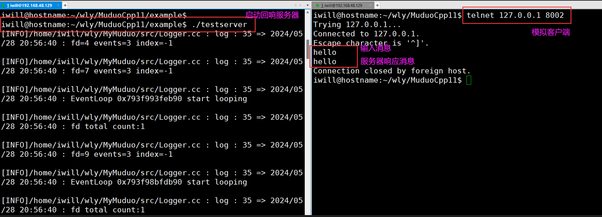

# MuduoCpp11
This repositoriey is implemented by imitating the muduo library (c++11, not relying on the boost library)


# 1. Compile
```bash
sudo sh automake.sh
```

# 2. Test
```bash
cd example
make
./testserver                # Start the server
telnet 127.0.0.1 8002       # Simulate client connection
```




